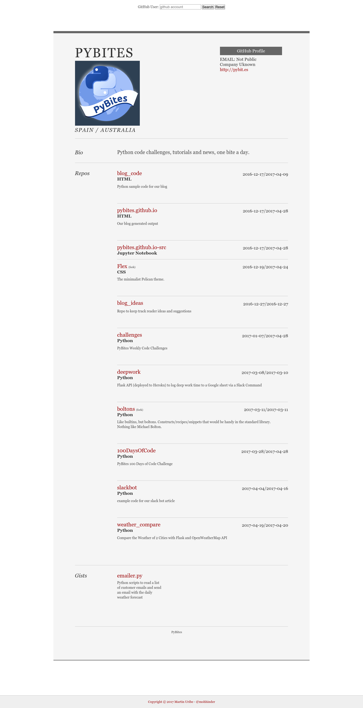

# GitHub Profiler

This Flask application will create a profile page for any valid GitHub username
that is entered into the form. It pulls the informatoin through GitHub's API and
displays it in a resume type format.

## Description
Currently it displays the following if it was made available:

    * accounts name
    * link to their GitHub page
    * email address
    * company
    * blog/website
    * repos
        * repo name
        * indicates if it's a fork
        * link to the repo
        * repo language
        * repo created date
        * repo last pushed date
        * repo description
    * gists
        * gist name
        * link to the gist
        * gist description

Entry page:

Sample run for pybites account:

## Issues
Since there a lot of API calls being made in the background, initially on new
searches it can take a few seconds. In order to aleviate this, the information
is stored in a sqlite3 database.

GitHub also limits the amount of API calls that can be made every hour to 60. If
you don't lookup more than one account per minute, you should be ok. I've made
my best to attempt to break it and code around those issues, but if you happen
to find a bug, please let me know.

## Installation
To install the app and try it out yourself, do the following from the
commandline:

    `cd <project-dir>`
    `git clone https://github.com/clamytoe/challenges.git`
    `cd challenges/16/clamytoe`
    `python3.6 -m venv venv`
    `source venv/bin/activate`
    `pip install -r requirements.txt`
    `python app.py`

Now simply open up a browser to http://localhost:5000 and enter a GitHub
username into the input box and click on the Submit button.

