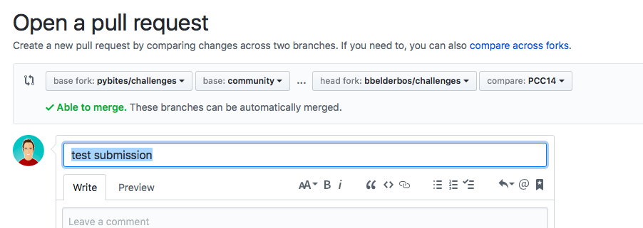
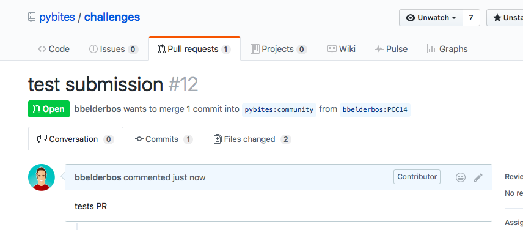

## To follow along with our challenges

## I. First time around

* Make your own fork of our [challenges repo](https://github.com/pybites/challenges): use the Fork button at the top right of the page.

* Clone your copy:

		$ git clone https://github.com/<your_user>/challenges

## II. You already cloned your fork

* In this case you need to [sync our new challenge(s)](https://help.github.com/articles/syncing-a-fork/), in your fork directory:

		# assuming using ssh key
		$ git remote add upstream git@github.com:pybites/challenges.git
		$ git fetch upstream

		# if not on master:
		$ git checkout master
		$ git merge upstream/master
		# at this point you are asked to commit the merge

* Have fun :)

		$ cd <challenge-number>
		# edit <template>.py file

## III. Submit your code to our community branch via a Pull Request (PR)

This is still a bit of an experimental feature. We will update it as we go. If there is an easier way please let us know ...

* Work on community branch and get into sync. In your forked repo:

		$ git checkout community (might need -b the first time)

* Make sure you got the latest changes from PyBites:

		$ git pull upstream community

* From your local community branch Open a new branch, we use PCC<challenge_num> here as convention (PyBites Code Challenge)

		$ git checkout -b PCC14

* Add your code

		$ cd <challenge_number>
		$ mkdir <GH-username>
		$ add files ...
		
		e.g.
		$ cd 14
		$ mkdir bbelderbos && cd $_
		$ vi some_script.py
		...

* Commit your changes:
	
		$ git add .
		$ git commit -m "PCC14 bbelderbos"

* Push this local branch to your forked repo (origin is default remote after fork + clone):

		$ git push origin PCC14

* Go to your cloned repo and open a PR by comparing pybites community branch with your newly pushed local branch (make sure only the files of your changes are included):

	

	

	

The difficult part here was isolating the changes. We think that if you do the "git pull upstream community" into your local community branch, as described above, you should see only your changes, but we have to do some more testing. Please let us know how this goes ...

Finally we will check your code, merge it into our community branch, and feature it in our end-of-the-week review post. 

## IV. Optional - Detaching the fork

* One small issue with working with a forked repo is that Github wont actually recognize any of your activity. If you want to see your activity follow these steps. However be warned that it will prevent you from creating pull-requests.

1. On Github go to the settings page of your forked repo.
2. In the Danger Zone click on the Delete this repository button.
3. Type the full name of the repo in the box and click the button.
4. Create a new repo with the same name as the original repo.
5. Push the repo to Github

		$ git push origin master

---

## Feedback

* If you want to share your solution, please use the comments of [our review posts](http://pybit.es/pages/challenges.html).

* If you have ideas for new challenges or issues with existing ones, please use the [issues page](https://github.com/pybites/challenges/issues).

---

Remember: there is no best solution, only learning more/ better Python. We're looking forward reviewing our and your solutions.
Good luck and have fun!

Keep Calm and Code in Python!

-- Bob and Julian
